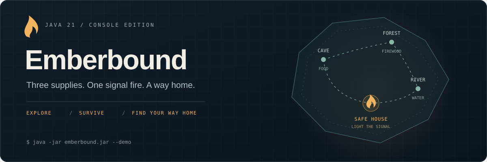

# Emberbound



[](https://github.com/cihat-kose/java-adventure-game/actions/workflows/ci.yml)
[](https://openjdk.org/projects/jdk/21/)
[](https://maven.apache.org/)
[](https://docs.junit.org/5.13.4/user-guide/)
[](LICENSE)

A complete, turn-based survival adventure for the terminal. Explore a fog-bound island, survive its inhabitants, and gather **Food, Firewood and Water**. Bring them back to the Safe House to light a signal fire and escape.

Built with **Java 21**, with a UI-independent rules engine, validated save files, and automated tests. The console is the first playable interface; the game rules can be reused by a future web application.

[Play](#play) · [Game guide](docs/GAMEPLAY.md) · [Architecture](docs/ARCHITECTURE.md) · [Türkçe](docs/README.tr.md)

## Play

Install **JDK 21 or newer** and point `JAVA_HOME` to it. Maven is downloaded automatically by the included [Maven Wrapper](https://maven.apache.org/tools/wrapper/). The first build needs internet access; the packaged game runs offline.

```sh
git clone https://github.com/cihat-kose/java-adventure-game.git emberbound
cd emberbound
```

**Windows — PowerShell or Command Prompt**

```powershell
.\play.cmd
```

**macOS / Linux**

```sh
sh ./play.sh
```

The launchers build the game and use the JDK in `JAVA_HOME`. They do not run the test suite; use `verify` below before contributing.

**Just want to see it?** Add `--demo` to either launcher. It plays a complete expedition through the real game, with visible inputs and no save-file access:

```text
  --- YOU ESCAPED ---
  Food for the crossing. Water for the journey. Firewood for a signal.
  A sail appears beyond the fog. Ada, you are going home.
  Enemies defeated: 6 | Supplies: 3/3 | Gold: 46
```

Already built? Run `java -jar target/emberbound.jar` with Java 21+. Run `java -version` if you see `UnsupportedClassVersionError`; the launchers avoid a mismatched Java on your PATH when `JAVA_HOME` is set.

## The expedition

| Place | What you will find |
| --- | --- |
| Safe House | Free healing; escape when all three supplies are collected |
| Tool Store | Three weapon upgrades, three armor upgrades, and healing bandages |
| Cave | 1–3 zombies guarding **Food** |
| Forest | 1–3 vampires guarding **Firewood** |
| River | 1–3 bears guarding **Water** |

Choose Samurai, Archer, or Knight. Attack first, anticipate the counterattack, and retreat when the odds turn against you. Defeated enemies stay defeated; cleared regions cannot be farmed. Every class can finish the game using the starting resources and earned gold.

The journal tracks objectives. Save from the map, save and quit, or preserve a completed expedition at the ending. There is **no autosave**; a defeat leaves your previous checkpoint available.

```sh
java -jar target/emberbound.jar --seed 7
java -jar target/emberbound.jar --save .saves/second-expedition.properties
java -jar target/emberbound.jar --demo
java -jar target/emberbound.jar --help
```

The default slot is `.saves/expedition.properties`, relative to the working directory. A new save replaces that slot; use `--save` for separate expeditions. The launchers use the repository directory.

## Engineering

| Concern | Implementation |
| --- | --- |
| Rules independent of presentation | Domain objects and the combat state machine contain no console or filesystem code |
| Reproducibility | Seeded populations are generated once and preserved across saves and retreats |
| Defensive state transitions | Health bounds, one-time rewards, equipment upgrades, explicit victory and defeat |
| Persistence | Versioned UTF-8 text, bounded reads, full validation before loading, temporary-file replacement |
| Input handling | A single line reader, retries for invalid input, graceful EOF at every prompt |
| Verification | JUnit 5 scenarios, 300 seeded campaign runs, JaCoCo coverage gate, Spotless formatting |
| Delivery | Executable JAR; GitHub Actions configured for Java 21 on Windows and Linux |

Read the [architecture and tradeoffs](docs/ARCHITECTURE.md), including the path to a future frontend. This is a single-player Java application; it currently has no HTTP API, database, or browser client.

## Build and verify

```powershell
# Windows
.\mvnw.cmd verify
.\mvnw.cmd spotless:apply
```

```sh
# macOS / Linux
sh ./mvnw verify
sh ./mvnw spotless:apply
```

`verify` compiles with warnings treated as errors, runs tests, checks formatting, builds `target/emberbound.jar`, and enforces **at least 80% line coverage**. The readable coverage report is at `target/site/jacoco/index.html`; test results are in `target/surefire-reports/`.

Tests cover combat ordering, retreat, death, victory, purchase failures, corrupted saves, failed file replacement, input recovery, save/resume, and the complete console demo. Campaign tests exercise all three characters over 100 seeds each.

The CI workflow uploads the executable, demo transcript, and reports after a successful run. Its badge reflects published workflow runs, not local verification.

## Project layout

```text
src/main/java/dev/emberbound/
  Main.java           Entry point and command-line options
  domain/             Characters, equipment, player and expedition state
  engine/             Combat actions, outcomes and state transitions
  cli/                Terminal navigation, presentation and demo
  persistence/        Save boundary and validated file implementation
src/test/java/dev/emberbound/
docs/                 Gameplay, architecture and portfolio notes
.github/workflows/    Cross-platform verification
```

The original character, enemy, weapon and armor statistics are retained. The initial prototype has been completed and reorganized around the Emberbound game identity; the existing repository URL is unchanged.

Contributions: [CONTRIBUTING.md](CONTRIBUTING.md). Project presentation: [portfolio notes](docs/PORTFOLIO.md). Licensed under [MIT](LICENSE).
