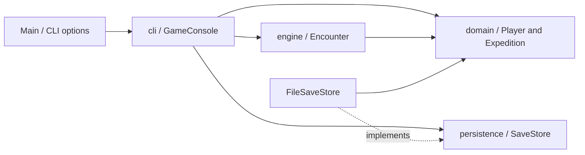
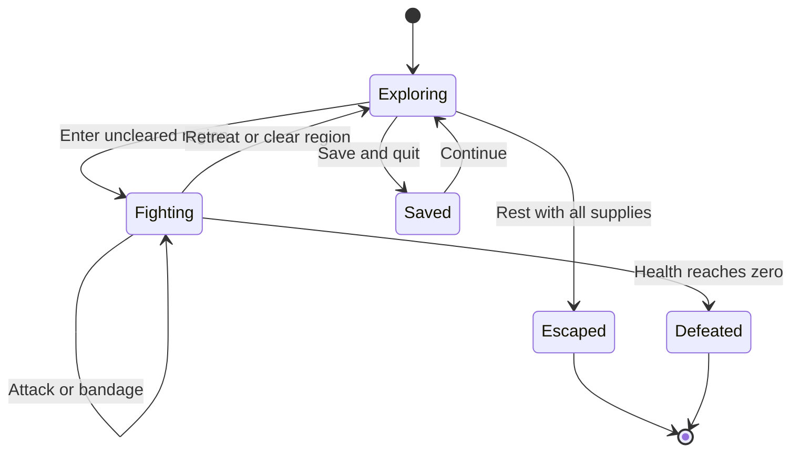

# Architecture and decisions

Emberbound is a single-player Java 21 application with a terminal adapter. Its scope is deliberately small enough to understand in one sitting: 14 production source files, no runtime libraries, and a complete playable loop.

## Boundaries

| Package | Responsibility | Dependencies |
| --- | --- | --- |
| `domain` | Immutable game catalogs and guarded mutable player/quest state | Java standard library |
| `engine` | Combat actions and typed turn results | `domain` |
| `cli` | Menus, text, input retries, a scripted playable demo | `domain`, `engine`, `SaveStore` |
| `persistence` | Save contract and file adapter | `domain`, Java file APIs |

`Main` is the composition root: it selects streams, the save path and the new-game seed. `Console` owns the single input reader. The domain never reads input, prints output, or opens files. `Encounter.Turn` contains structured outcomes and numeric damage/healing/rewards; the terminal decides how to display them.

## State transitions

An expedition owns its player and regional progress. Each region's total enemy count is rolled once using a seeded `Random`. The total and remaining count are persisted; no random generator state needs to be reconstructed after loading.

Saving is exposed only outside combat. A retreat commits completed kills but discards the current enemy's partial damage. This keeps checkpoints small and prevents rerolling populations or collecting the same reward twice through ordinary navigation.

Health never drops below zero, armor never creates negative damage, healing never exceeds maximum health, and a dead player cannot rest or buy items. Purchase validation happens before either gold or equipment is changed. Returning home is a separate victory transition after collecting the last supply.

The mutable model assumes one application thread. It is not a concurrent server session API. Public mutation methods are intended to be driven by the application; a future server should expose commands through a session service, not return mutable entities to clients.

## Persistence

`SaveStore` is a two-operation interface. Tests can substitute an in-memory implementation or a failing store without mocking static file APIs. The file implementation uses UTF-8 Java properties and an explicit schema version.

Loading reads at most 16 KiB plus one byte and validates required fields, known enum values, numeric ranges, regional consistency, a living player, and victory preconditions before returning an expedition. An invalid or unsupported save produces an actionable error and is not rewritten. These files are editable local checkpoints, not tamper-proof or authenticated records.

Saving writes to a temporary file in the destination directory, closes the writer, then replaces the destination with an atomic move when supported. If the filesystem does not support atomic moves, it falls back to a normal replace; power-loss guarantees are weaker in that case. Temporary files are cleaned up after success or failure. This is not a durable transactional database, and concurrent writers to the same slot are not supported.

## Why these choices

- **Enums for catalogs:** hero, weapon, armor and enemy variations are data, with identical behavior. Separate subclasses per character would add indirection without a distinct policy.
- **Typed combat results:** presentation can change without parsing terminal strings or rewriting combat.
- **Manual dependency injection:** readers, writers and the save boundary are passed into constructors. This project does not need a container or application framework.
- **Plain-text saves:** a small, inspectable schema suits an offline single-player game. Java object deserialization is not used.
- **Seeded population, deterministic combat:** reproducible scenarios make bug reports, tests and demonstrations practical. Choices and resource management provide the challenge.
- **Conservative survival route:** every class remains winnable, even with three enemies in each region, by retreating and resting. Test scenarios check this without granting extra gold or equipment.

## Verification and delivery

`mvnw verify` runs JUnit tests, checks the Java format, builds the executable JAR, generates a JaCoCo report and enforces an 80% overall line-coverage floor. Compiler warnings fail the build. Tests target failure boundaries and observable behavior: damage ordering, rewards, no-op healing, purchase atomicity, invalid saves, write failures, input recovery and complete campaigns.

The Maven Wrapper fixes Maven at 3.9.16. Java and test/build plugin versions are declared in `pom.xml`. The JAR has a fixed build timestamp for reproducible archive entries. CI is configured for Windows and Linux with JDK 21; published runs upload both game and verification artifacts.

## A future web edition

These are next steps, **not current features**:

1. Add a session application service that accepts commands such as start, travel, attack, heal, retreat and buy. Return immutable snapshots plus turn results. Keep the existing CLI as one client of that service.
2. Add an HTTP adapter, for example with Spring Boot, and explicit request/response DTOs. Keep the server authoritative for damage, rewards and inventory; validate transitions again at the boundary.
3. Build a browser interface around the same loop: island map, encounter panel, inventory and journal. Use the terminal demo as a reproducible acceptance scenario.
4. Introduce database-backed session storage only when persistence across users/devices is needed. Add ownership checks, request idempotency and optimistic locking before supporting concurrent requests.

The current boundaries make the rules reusable; they do not make a future networked edition a zero-effort change. HTTP contracts, concurrency, authentication, database migrations and browser interaction still need their own design and tests.
